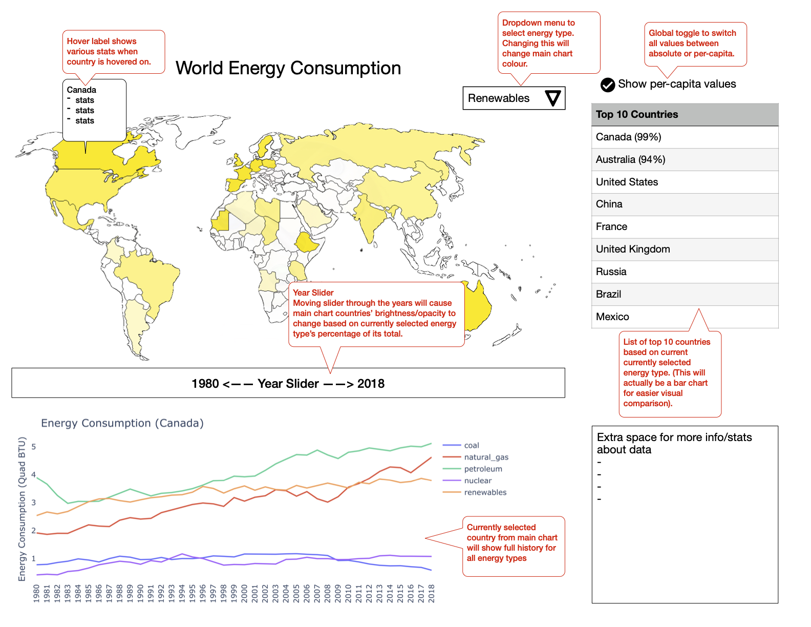

# World Energy Consumption Dashboard
- author: DSCI 532 group 23

Link to Dashboard: https://world-energy-group23.herokuapp.com/

This is a group project of designing a dashboard for world energy consumption. 

The main feature of this app is an interactive world map, which will display energy consumption per category for each country. The map will change is primary colour based on the currently selected energy type, and each country's brightness/opacity will change depending on that energy type's percentage of total. The slider underneath the main map will be able to move through each year, with the main map updating colours at each step. To the right of the main map will be a bar chart which shows the top 10 consumers of the currently selected energy type and year. Beneath the main map will be a secondary line chart, which gives a full history of energy consumption over time, with the currently selected country from the main map. The main map will also have interactive hover labels, which show certain stats per country. All main values on the chart will also have the ability to be toggled by absolute value, or per-capita.

